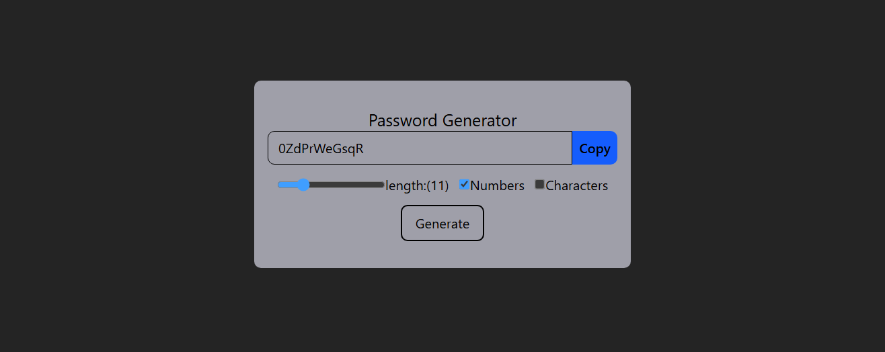

# 🔐 React Password Generator

A sleek and simple password generator built using **React** + **Vite**. This tool allows users to generate secure passwords based on selected parameters such as length, inclusion of numbers, special characters, and provides a one-click copy to clipboard feature.

## 🚀 Features

- Set desired **password length**
- Choose to include:
  - ✅ Numbers
  - ✅ Special characters
- 🔁 Generates a random, secure password
- 📋 One-click **Copy to Clipboard** button
- ⚡ Built with React + Vite for lightning-fast performance

## 🖼️ Preview

 <!-- Add your screenshot here -->

## 🛠️ Tech Stack

- React
- Vite
- Tailwind CSS (optional, if used for styling)
- JavaScript (ES6+)

## 📦 Installation

```bash
git clone https://github.com/CSShubham/Password-Generator-React
cd react-password-generator
npm install
npm run dev
```
## 🔧 Usage  
Select the desired password length using the number input/slider.  

Choose to include numbers and/or special characters via checkboxes or toggles.  

Click the "Generate Password" button.  

Click "Copy" to copy the generated password to your clipboard.  

# React + Vite

This template provides a minimal setup to get React working in Vite with HMR and some ESLint rules.

Currently, two official plugins are available:

- [@vitejs/plugin-react](https://github.com/vitejs/vite-plugin-react/blob/main/packages/plugin-react) uses [Babel](https://babeljs.io/) for Fast Refresh
- [@vitejs/plugin-react-swc](https://github.com/vitejs/vite-plugin-react/blob/main/packages/plugin-react-swc) uses [SWC](https://swc.rs/) for Fast Refresh

## Expanding the ESLint configuration

If you are developing a production application, we recommend using TypeScript with type-aware lint rules enabled. Check out the [TS template](https://github.com/vitejs/vite/tree/main/packages/create-vite/template-react-ts) for information on how to integrate TypeScript and [`typescript-eslint`](https://typescript-eslint.io) in your project.
